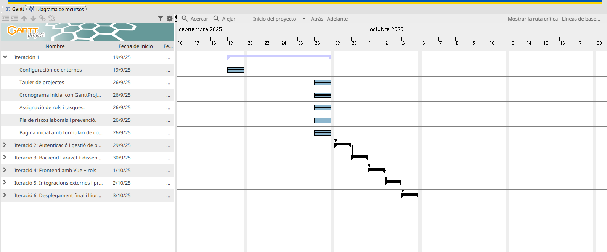

# Planificación Temporal y Cronograma

**Objetivo:** Definir la hoja de ruta cronológica del proyecto para cumplir con los plazos de entrega, asegurando una transición fluida entre las fases de diseño y desarrollo.

---

## 🗓️ 1. Cronograma Inicial: La Fase de Estimación

Al comienzo del proyecto, la prioridad fue establecer una estructura temporal clara. Para ello, utilizamos **GanttProject**, una herramienta que nos permitió visualizar el proyecto como una secuencia lógica de hitos y dependencias.

### Diagrama de Gantt del Proyecto

El siguiente diagrama muestra la planificación de nuestras 6 iteraciones clave, desde la configuración inicial hasta el despliegue final:

- **Hitos Definidos:**
    - **Iteración 1:** Configuración de entornos y definición de marca.
    - **Iteración 2-3:** Desarrollo del Core (Autenticación y Backend Laravel).
    - **Iteración 4-5:** Desarrollo del Frontend (Vue.js) e Integraciones externas.
    - **Iteración 6:** Pruebas finales y Despliegue de la solución.

---

## 🚀 3. Hitos Críticos y Dependencias

La planificación temporal nos permitió identificar tareas bloqueantes esenciales para el éxito del proyecto:

1.  **Arquitectura de Base de Datos:** Debía estar finalizada antes de cualquier desarrollo de API.
2.  **API REST (Backend):** Actuó como el contrato necesario para que el equipo de Frontend pudiera trabajar de forma independiente.
3.  **Despliegue Continuo:** La configuración temprana del entorno remoto aseguró que no hubiera sorpresas en la fase final de entrega.

---

> [!NOTE]
> **Lección aprendida:** La planificación con Gantt nos dio la base necesaria para entender la envergadura del proyecto, mientras que la agilidad de GitHub nos dio la velocidad para completarlo.
