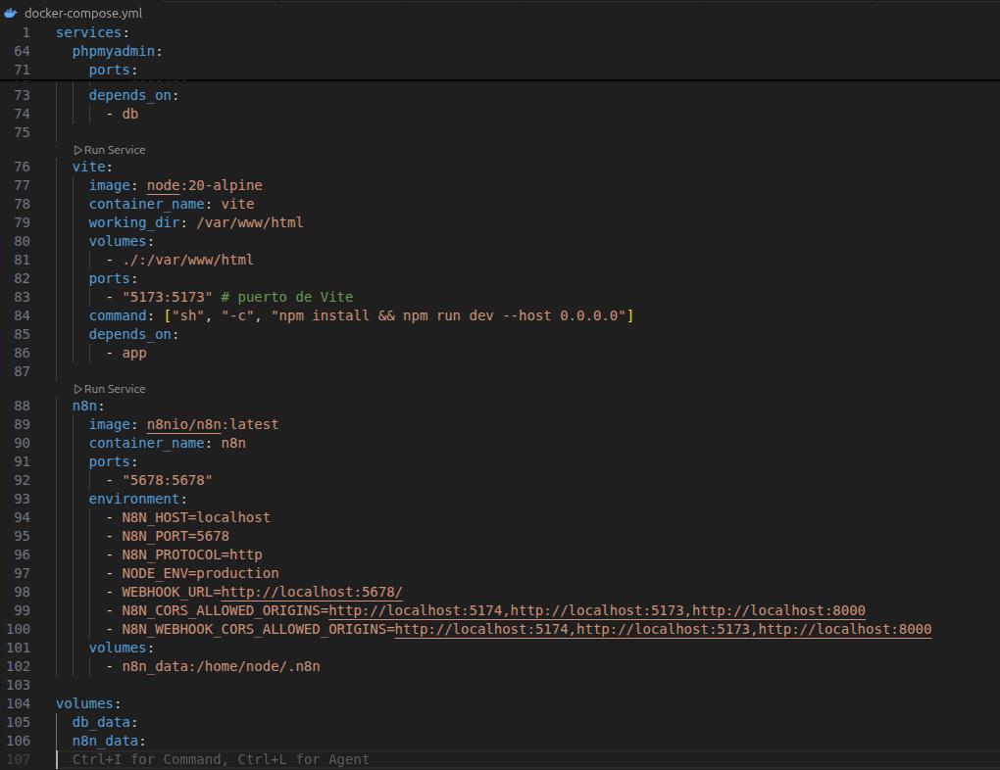
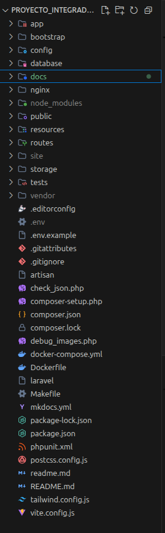

# 💾 Copias de Seguridad y Despliegue

!!! info "Objetivo del Sistema"
Garantizar la **integridad, persistencia y disponibilidad** de los datos fuera del entorno de desarrollo local, protegiendo la información de TaskLink ante fallos técnicos o reajustes del sistema.

---

## 🏗️ 1. Persistencia de Datos (Docker Volumes)

En TaskLink, utilizamos volúmenes persistentes gestionados por Docker para asegurar que la base de datos no sea efímera:

<div style="display: flex; align-items: center; gap: 25px; margin-bottom: 20px;">
  <div style="flex: 1.5;">
    <ul>
      <li><strong>Configuración del Volumen:</strong> En el archivo <code>docker-compose.yml</code>, el servicio de base de datos (<code>db</code>) está vinculado al volumen <code>db_data</code>.</li>
      <li><strong>Persistencia:</strong> Esto garantiza que, aunque detengas los contenedores con <code>make down</code> o los elimines, tus datos de MySQL seguirán intactos en tu disco duro al volver a iniciarlos.</li>
    </ul>
  </div>
  <div style="flex: 1; text-align: right;">
    
  </div>
</div>

!!! warning "⚠️ Alerta de Seguridad: Comando `make reset`"
Hay que tener precaución con el comando `make reset` definido en nuestro `Makefile`. Este comando ejecuta `docker compose down -v`, lo que **borra permanentemente todos los volúmenes**. Se usaría únicamente si deseas limpiar el sistema y empezar de cero desde los seeders.

---

## 📂 2. Gestión de Copias de Seguridad (Manual)

Para realizar una copia de seguridad manual fuera del ecosistema Docker, se puede ejecutar de la siguiente forma desde un terminal local:

```bash
# Exportar la base de datos completa a un archivo .sql
docker exec -t db mysqldump -u laravel -plaravel laravel > backup_tasklink.sql
```

!!! tip "Restauración de Datos"
Para restaurar un backup previamente guardado, se puede redirigir el archivo de vuelta al contenedor de la base de datos:
`cat backup_tasklink.sql | docker exec -i db mysql -u laravel -plaravel laravel`

---

## 🚀 3. Despliegue en Servidor Remoto

La transición de local a producción se apoya en la flexibilidad del archivo de configuración de entorno.

<div style="display: flex; align-items: start; gap: 30px; margin-top: 20px;">
  <div style="flex: 1;">
    
  </div>
  <div style="flex: 1.5;">
    <ul>
      <li><strong>Variables de Producción:</strong> Al desplegar en un servidor real, el archivo <code>.env</code> debe ajustarse:
        <ul>
          <li><code>APP_ENV=production</code>: Cambia el modo de la aplicación.</li>
          <li><code>APP_URL</code>: Debe apuntar al dominio final (ej: <code>http://proyecteGrup8.com</code>).</li>
          <li><code>DB_HOST</code>: Suele cambiar a la IP del servidor de base de datos o el nombre del servicio en producción.</li>
        </ul>
      </li>
    </ul>
    <ul>
      <li><strong>Protección de Datos:</strong> Nos aseguramos de que <code>APP_DEBUG</code> esté en <code>false</code> para no exponer información sensible en caso de error.</li>
    </ul>
  </div>
</div>

<div style="margin-top: 20px;">

  <p style="font-style: italic; color: #666; margin-top: 15px; border-left: 4px solid #eee; padding-left: 15px;">
    <strong>Estructura de Carpetas:</strong> Vista del directorio raíz donde reside el archivo <code>.env</code>. Es fundamental asegurar que este archivo esté incluido en <code>.gitignore</code> para evitar fugas de credenciales en el repositorio público.
  </p>
</div>

---

!!! success "Entorno de Producción Listo"
Con esta configuración de volúmenes y la gestión controlada de copias de seguridad, TaskLink está preparado para un despliegue seguro y mantenible a largo plazo.
