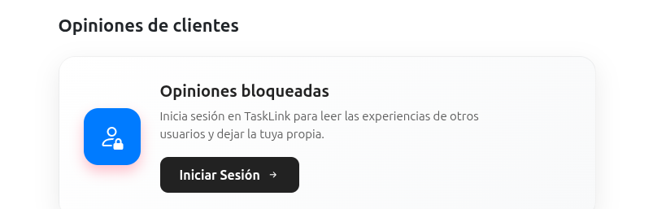
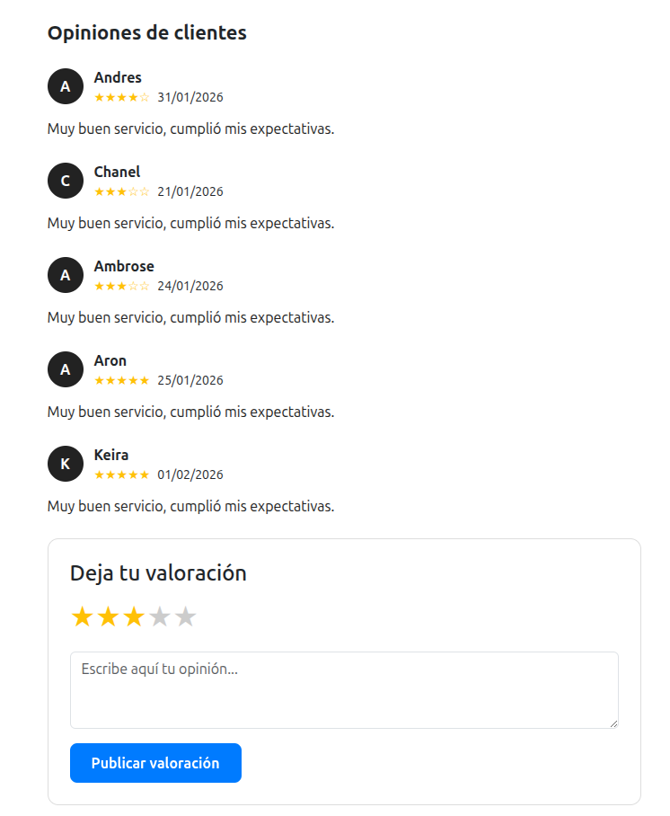

# ⭐ Sistema de Interacción: Comentarios y Valoraciones

!!! info "Objetivo del Sistema"
Establecer un canal de comunicación transparente y fomentar la **confianza** mediante el feedback directo. En TaskLink, la reputación de los profesionales se construye a través de experiencias reales verificadas.

---

## 🛠️ 1. Estructura Técnica (Backend)

La arquitectura de valoraciones está diseñada para ser ligera y relacional, permitiendo consultas rápidas de reputación:

  

    <ul>
      <li><strong>Modelo <code>ValoracionServicio</code>:</strong> Actúa como el puente crítico entre <code>Usuario</code> (cliente) y <code>Servicio</code>. Gestiona campos como la puntuación numérica, el comentario de texto y la marca de tiempo.</li>
      <li><strong>Cálculo en Tiempo Real:</strong> En lugar de guardar promedios estáticos, el modelo <code>Servicio</code> utiliza un <strong>Accessor (<code>promedio_valoracion</code>)</strong> que calcula la media aritmética de las puntuaciones cada vez que se solicita el servicio. Esto garantiza que la información siempre esté actualizada.</li>
    </ul>
  

  

    
  

---

## 🧠 2. Lógica de Negocio y Restricciones

Para evitar el spam y garantizar la calidad del feedback, el `ValoracionApiController` aplica reglas estrictas antes de persistir cualquier dato:

!!! abstract "Reglas de Validación"
_ **Control de Duplicados (Anti-Spam):** El sistema verifica si el usuario ya ha valorado ese servicio específico antes de permitir una nueva entrada. Si ya existe, devuelve un error `422 Unprocessable Content`.
_ **Rango de Calidad:** Las puntuaciones están limitadas estrictamente al rango **1 a 5** mediante validaciones de Laravel. \* **Integridad del Autor:** Solo los usuarios con un token de sesión válido (**Sanctum**) pueden publicar, asegurando que cada comentario provenga de un cliente real.

---

## 🎨 3. UI/UX: Visualización en el Frontend

La experiencia del usuario se enriquece mediante la integración visual de estas valoraciones en toda la plataforma:

  

    
  

  

    <ul>
      <li><strong>Tarjetas de Servicio:</strong> Mostramos la media de estrellas y el número total de valoraciones directamente en la lista principal para facilitar la decisión de compra.</li>
      <li><strong>Detalle del Servicio:</strong> Una sección dedicada lista cronológicamente los comentarios, permitiendo a los futuros clientes leer las reseñas detalladas.</li>
    </ul>
  

---

!!! success "Hacia una Comunidad de Confianza"
Este sistema no solo mide la calidad, sino que incentiva a los profesionales de TaskLink a mantener la excelencia, creando un ciclo de feedback positivo que beneficia a todo el ecosistema.
