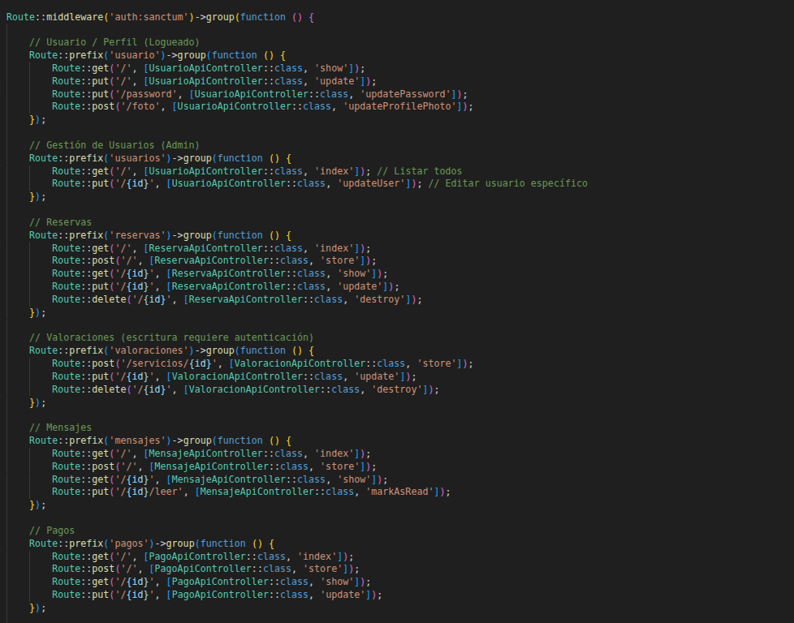
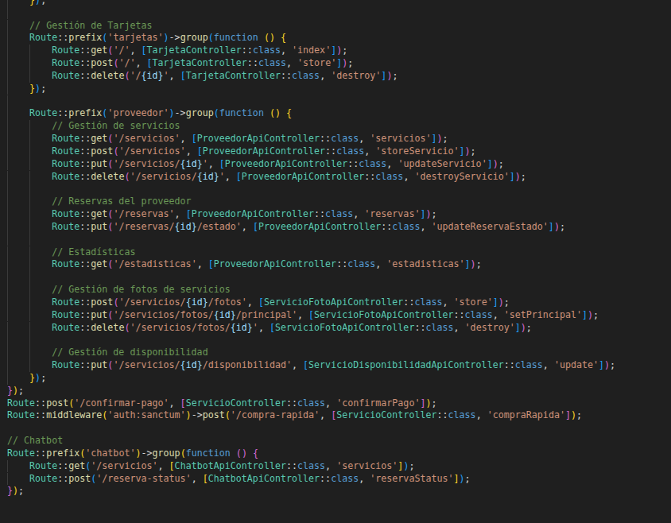
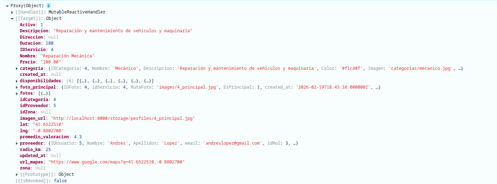

# 🚀 Desarrollo de la API RESTful

!!! info "Objetivo del Sistema"
    Exponer la funcionalidad central de TaskLink mediante servicios web estandarizados, permitiendo una comunicación fluida, segura y eficiente con la SPA (Single Page Application) y otros posibles clientes.

---

## 🛣️ 1. Estructura de Rutas y Capas de Datos

Nuestra API está organizada en grupos lógicos que mapean directamente las entidades del negocio con nuestra persistencia en la base de datos MySQL.

  

    | Grupo de API | Modelo Principal | Tabla de Origen |
    | :--- | :--- | :--- |
    | `/login`, `/logout` | `Usuario` | `usuarios` |
    | `/servicios` | `Servicio` | `servicios` |
    | `/categorias` | `Categoria` | `categorias` |
    | `/reservas` | `Reserva` | `reservas` |
    | `/valoraciones` | `ValoracionServicio` | `valoracion_servicios` |
    | `/proveedor` | Varios | Múltiples |
    
    

      La organización se basa en <strong>Prefijos</strong> que agrupan funciones por recurso, facilitando el mantenimiento y la escalabilidad del sistema a medida que se añaden nuevas funcionalidades.
    

  

  

    
    
  

---

## 🛡️ 2. Seguridad y Middleware

La protección de los recursos se gestiona mediante capas de middleware que garantizan la integridad de cada llamada:

- **Laravel Sanctum:** Es el motor de autenticación. Utilizamos el middleware `auth:sanctum` para blindar las rutas que requieren identidad confirmada.
- **Gestión de Estado (Stateful):** Implementamos `EnsureFrontendRequestsAreStateful` de Laravel. Esto permite que la SPA se comunique con la API usando cookies de sesión seguras.

---

## 📦 3. Transformación y Respuestas JSON

Para garantizar que el frontend reciba información limpia y profesional, seguimos un proceso de estandarización:

!!! abstract "Transformación de Datos"
_ **Ocultación de Sensibles:** Mediante la propiedad `protected $hidden` en los modelos eloquent (como `Usuario`), nos aseguramos de que campos como contraseñas o tokens internos nunca viajen por la red.
_ **Estandarización de Errores:** Todas las respuestas de error se devuelven en formato JSON con su código HTTP correspondiente (200, 201, 401, 422, 500).

  
  

    <strong>Tratamiento de Datos:</strong> Ejemplo de salida procesada donde se observa la limpieza de campos internos y la focalización en los datos necesarios para la interfaz.
  

---

!!! success "API Escalable y Segura"
    Gracias a este diseño desacoplado, TaskLink puede evolucionar de forma independiente en su frontend y backend, manteniendo siempre un contrato de datos sólido y seguro.
