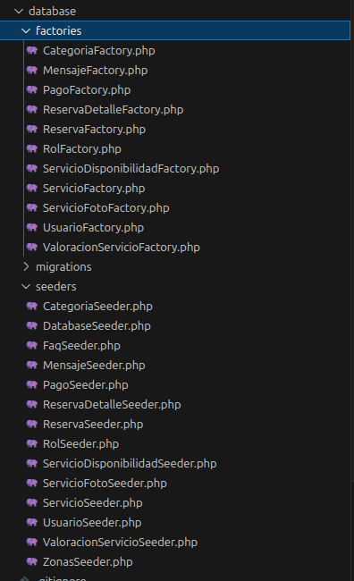

# 🏗️ Arquitectura Backend con Laravel MVC

!!! info "Filosofía de Desarrollo"
    El corazón de TaskLink está construido sobre **Laravel**, siguiendo el patrón de diseño **MVC** (Modelo-Vista-Controlador) y aplicando principios de código limpio para garantizar una plataforma robusta, escalable y mantenible.

---

## 🏛️ 1. Patrón MVC: Estructura y Responsabilidades

Nuestro backend organiza la lógica para desacoplar la persistencia de la presentación:

- **Modelos (Eloquent):** Ubicados en `app/Models/`, no solo representan tablas de la base de datos, sino que encapsulan la lógica de negocio, relaciones (`hasMany`, `belongsTo`) y transformaciones automáticas de datos.
- **Controladores (API):** Situados en `app/Http/Controllers/Api/`, actúan como orquestadores. Reciben peticiones HTTP, validan la entrada y coordinan la respuesta JSON.
- **Rutas Desacopladas:** Utilizamos `routes/api.php` para definir un contrato claro con el frontend, separando la lógica de navegación de la lógica de servicios.

---

## 💎 2. El Poder de Eloquent ORM

Eloquent es la pieza clave que nos permite interactuar con MySQL de forma elegante y eficiente:

!!! abstract "Técnicas de Optimización"
_ **Eager Loading:** Utilizamos la función `with()` (ej. `Servicio::with('categoria')`) para resolver el problema de las consultas N+1, cargando todas las relaciones necesarias en una sola llamada a la base de datos.
_ **Accessors y Mutators:** Implementamos atributos virtuales como `PromedioValoracion` e `ImagenUrl`, permitiendo que el frontend reciba datos listos para consumir sin lógica adicional. \* **Lógica Geoespacial:** Hemos integrado consultas SQL nativas dentro de Eloquent para calcular distancias en tiempo real entre el usuario y los proveedores de servicios.

  
  

    <strong>Automatización:</strong> Uso de Factories y Seeders para generar escenarios de prueba realistas y complejos.
  

---

## 🔌 3. Inyección de Dependencias y Service Container

Aprovechamos el **Service Container** de Laravel para inyectar dependencias automáticamente en nuestros controladores. Esto facilita:

1.  **Testabilidad:** Permite mockear servicios durante las pruebas unitarias.
2.  **Desacoplamiento:** El controlador no necesita saber cómo se instancia un servicio, solo pide lo que necesita en el constructor o método.

---

!!! success "Código de Grado Empresarial"
    Esta arquitectura asegura que TaskLink pueda crecer en funcionalidad sin comprometer la velocidad de respuesta ni la integridad de los datos.
