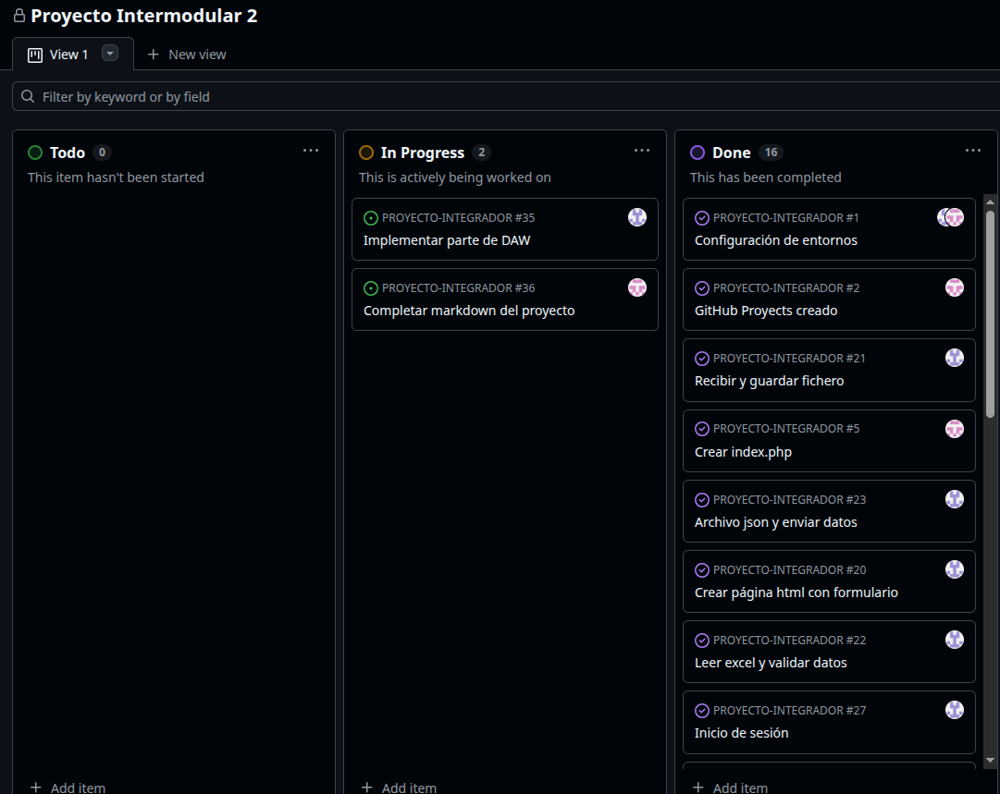

# 🧪 Pruebas y Documentación de Calidad

!!! info "Compromiso con la Calidad"
    Para asegurar que TaskLink sea una plataforma fiable, hemos implementado una suite de pruebas automatizadas y estándares de documentación que facilitan el mantenimiento a largo plazo y la colaboración entre desarrolladores.

---

## ⚙️ 1. Pruebas Automáticas con PHPUnit

Utilizamos **PHPUnit** como nuestro motor de pruebas principal, cubriendo los flujos críticos de la aplicación:

- **Feature Tests:** Pruebas de integración que simulan peticiones HTTP reales a nuestra API. Verificamos que los endpoints de **Autenticación, Servicios y Reservas** devuelvan los códigos de estado correctos (200 OK, 201 Created, 401 Unauthorized) y la estructura JSON esperada.
- **Unit Tests:** Pruebas aisladas para validar la lógica pura de negocio en modelos y helpers, asegurando que los cálculos (como disponibilidad o precios) sean siempre exactos.

!!! abstract "Ejecución de Pruebas"
    Para validar la integridad del sistema antes de cada despliegue, ejecutamos el siguiente comando en el entorno de desarrollo:
`bash
    php artisan test
    `

---

## 📝 2. Documentación del Código (PHPDoc)

La claridad del código es tan importante como su funcionalidad. Por ello, seguimos el estándar **PHPDoc** en todo el proyecto:

- **Tipado Estricto:** Documentamos tipos de retorno y parámetros en controladores y modelos.
- **Contexto de Negocio:** Añadimos descripciones claras a métodos complejos para que cualquier desarrollador pueda entender el _porqué_ de una implementación en segundos.
- **Soporte de IDE:** Esta práctica permite un autocompletado inteligente y una detección de errores temprana en herramientas como VS Code.

  
  

    <strong>Gestión del Ciclo de Vida:</strong> Vinculamos cada tarea y prueba con nuestro tablero de gestión para un seguimiento total del progreso y la calidad.
  

---

!!! success "Estabilidad Garantizada"
    Gracias a este rigor técnico, TaskLink minimiza la aparición de regresiones y se posiciona como un proyecto profesional listo para escalar en producción.
