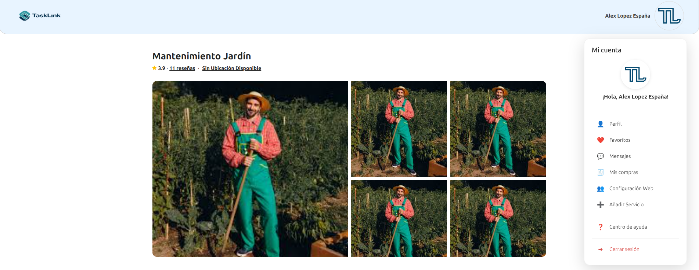
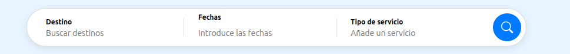
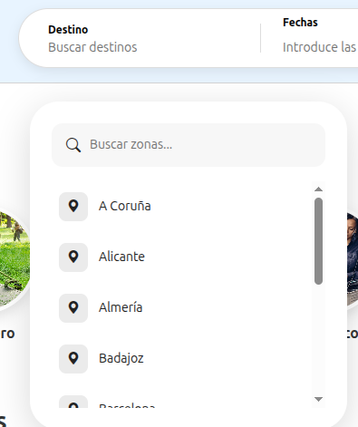
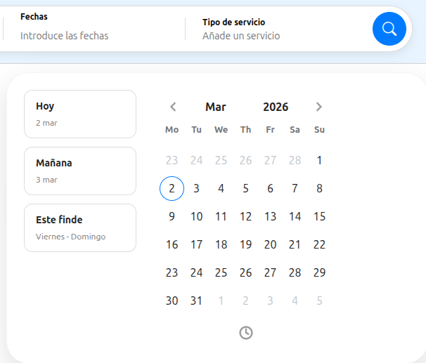
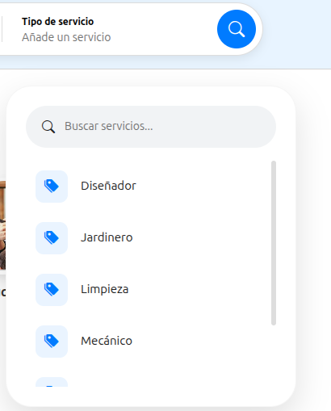
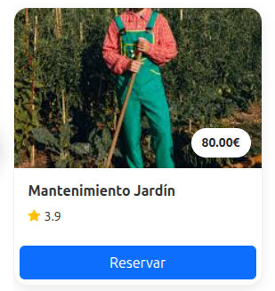
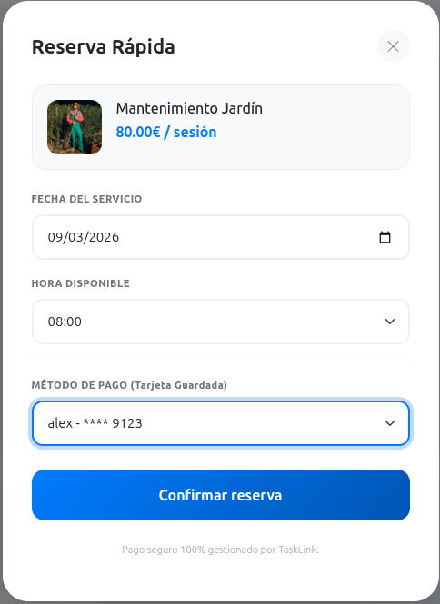
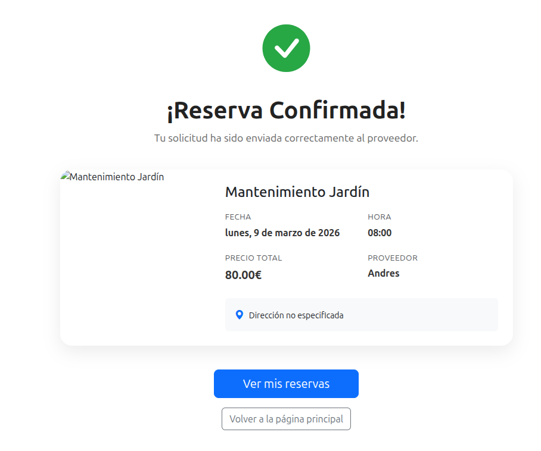

# 📖 Guía de Usuario Inicial

!!! info "Bienvenido a TaskLink"
Esta guía está diseñada para que cualquier usuario, sin importar sus conocimientos técnicos, pueda aprovechar al máximo todas las funciones de búsqueda, contratación y gestión de servicios que ofrece nuestra plataforma.

---
## 🚀 1. Primeros Pasos: Mi Cuenta

  

Para empezar a disfrutar de TaskLink, solo necesitas seguir dos sencillos pasos:

<ol>
  <li>
    <strong>Registro Rápido:</strong>
    Accede a la pantalla de registro y completa tus datos básicos. 
    Recibirás un correo de bienvenida y tendrás acceso instantáneo a la plataforma.
  </li>
   
  <li>
    <strong>Configuración de Perfil:</strong>
    Desde tu panel personal, podrás gestionar tu información y tarjetas guardadas.
  </li>
</ol>

  

  

    
  

---

### 🖥️ Interfaz del Buscador

  

<strong>Centro de Control:</strong>  
Desde aquí puedes filtrar por <strong>destino, fecha o categoría</strong>, dependiendo de lo que sea más prioritario para ti. Es el punto de partida para encontrar el profesional ideal.

  

  

    
  

### 🛠️ Modalidades de Búsqueda

  

<strong>📍 Por Ubicación:</strong>  
¿Necesitas a alguien cerca? Selecciona tu zona y el sistema calculará al instante si estás dentro del radio de servicio del profesional.

  

  

    
  

  

<strong>📅 Por Disponibilidad:</strong>  
¿Tienes prisa o un hueco específico? Indica tus fechas y solo verás a los proveedores que realmente tienen libre ese horario.

  

  

    
  

  

<strong>🛠️ Por Especialidad:</strong>  
Si buscas algo muy concreto como "Fontanería" o "Clases de Inglés", usa el filtro de categorías para ir directo al grano.

  

  

    
  

---

## 📅 3. Realizar una Reserva en 3 Pasos

Contratar un servicio profesional nunca ha sido tan sencillo y transparente:

### **1. Reserva Rápida**

Si tienes prisa, nuestra función de reserva rápida te permite ver los huecos disponibles directamente desde la tarjeta del servicio sin entrar al detalle.

{ style="border-radius: 12px; box-shadow: 0 4px 12px rgba(0,0,0,0.1); display: block; margin: 20px auto; max-width: 80%;" }

### **2. Selección de Detalles**

Al entrar en un servicio, podrás elegir el horario específico y ver toda la información detallada del profesional.

{ style="border-radius: 12px; box-shadow: 0 4px 12px rgba(0,0,0,0.1); display: block; margin: 20px auto; max-width: 80%;" }

### **3. Confirmación Segura**

Una vez elegido el horario y el método de pago, recibirás una confirmación visual instantánea con todos los datos de tu cita.

{ style="border-radius: 12px; box-shadow: 0 4px 12px rgba(0,0,0,0.1); display: block; margin: 20px auto; max-width: 80%;" }

---

!!! success "Soporte Inteligente Siempre Activo"
Si en cualquier momento te surge una duda, nuestro **Chat con IA 24/7** (icono azul abajo a la derecha) está entrenado para ayudarte con tus reservas y responder cualquier pregunta técnica.
