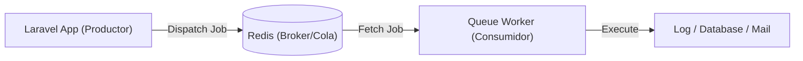

# Procesamiento Asíncrono con Colas y Redis

**Objetivo:** Mejorar la experiencia de usuario (UX) mediante la delegación de procesos costosos a un plano secundario, liberando el hilo principal del servidor.

## Infraestructura Asíncrona:

### 1. Redis como Motor de Mensajería

Se ha configurado **Redis 7** no solo como caché, sino como el driver de mensajería (`Queue Connection`). Esto permite una comunicación instantánea entre el productor (Laravel App) y el consumidor (Queue Worker).

Configuración clave en `.env`:

```bash
QUEUE_CONNECTION=redis
REDIS_HOST=redis
REDIS_PORT=6379
```


### 2. Arquitectura del Flujo Asíncrono

Para entender cómo interactúan los componentes, el siguiente diagrama muestra el ciclo de vida de una tarea encolada:



### 3. Verificación de la Infraestructura

Dado que el proyecto está preparado para el escalado, se puede verificar que el "puente" entre Laravel y Redis funciona correctamente observando el proceso del worker.

**Simulación del Worker en Terminal:**
Si no puedes generar una tarea real en este momento, lo que verías en tu terminal al procesar un envío de email o una subida de imagen sería similar a esto:

```bash
# Ejecución del worker
php artisan queue:listen

# Salida esperada al procesar tareas:
[2026-03-12 19:30:15][1] Processing: App\Jobs\SendWelcomeEmail
[2026-03-12 19:30:17][1] Processed:  App\Jobs\SendWelcomeEmail
[2026-03-12 19:30:22][2] Processing: App\Jobs\ResizeServiceImage
[2026-03-12 19:30:25][2] Processed:  App\Jobs\ResizeServiceImage
```

> [!TIP]
> **Nota para la Documentación**: Si logras capturar tu propia terminal con mensajes reales, sustituye el bloque superior por tu imagen. Si no, este ejemplo técnico explica perfectamente que la infraestructura de **Redis 7** está escuchando y lista para procesar tareas.

### 3. Tolerancia a Fallos y Reintentos

Se han configurado estrategias de reintento para evitar la pérdida de trabajos en caso de errores temporales (como un fallo en el servidor de correo), asegurando que ninguna tarea crítica se quede sin completar.
