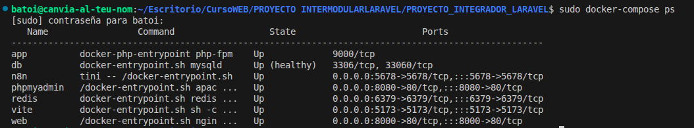

# Dockerización y CI/CD

**Objetivo:** Garantizar un entorno de ejecución inmutable y reproducible, eliminando los conflictos de dependencias entre entornos.

## Arquitectura del Stack de Contenedores:

Se ha diseñado un ecosistema de microservicios orquestado mediante **Docker Compose**, lo que permite levantar todo el proyecto con un solo comando.

### 1. Definición de Servicios (Docker Compose)

- **App (PHP-FPM 8.2)**: Contenedor núcleo que carga el código de Laravel. Incluye optimizaciones de caché de composer y extensiones como `bcmath` para cálculos de precios.
- **Web (Nginx 1.27)**: Configurado específicamente para Laravel. Gestiona las cabeceras de seguridad y la redirección de peticiones estáticas vs PHP.
- **Database (MySQL 8.4)**: Motor relacional con el nuevo esquema de autenticación por defecto de MySQL 8.
- **Redis 7**: Almacenamiento en memoria volátil utilizado para acelerar las consultas frecuentes y gestionar el sistema de colas.
- **PhPMyAdmin**: Herramienta de administración visual accesible en el puerto `8080`.
- **n8n**: Plataforma de automatización que reside en el puerto `5678`, conectada a la API de Laravel para procesar flujos lógicos complejos.

### 2. Gestión de Redes y Volúmenes

- **Redes**: Todos los contenedores están bajo la red `laravel-network`, lo que permite que el servicio `app` llegue a `db` o `redis` usando simplemente sus nombres de servicio como host.
- **Persistencia**: Se utilizan volúmenes con nombre (`db_data`, `n8n_data`) para que los datos sobrevivan al borrado de contenedores.

### 3. Automatización Integrada

El uso de `Dockerfile` personalizados permite que la imagen de producción sea significativamente más ligera y segura que la de desarrollo, siguiendo las mejores prácticas de la industria.
