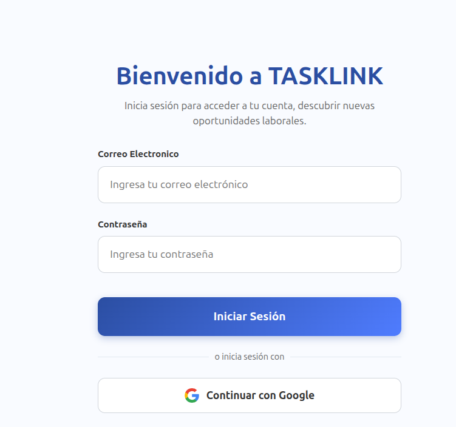

# Integración OAuth2 y Login Social

**Objetivo:** Proporcionar un método de autenticación moderno, rápido y seguro mediante la reutilización de identidades digitales de terceros.

## Flujo Técnico de Autenticación:

### 1. Implementación con Laravel Socialite

Se ha implementado el protocolo **OAuth2** utilizando el driver de **Google**. El sistema actúa como un cliente que solicita permisos específicos al proveedor de identidad.

- **Configuración de Client**: Las credenciales se gestionan de forma segura en las variables de entorno `GOOGLE_CLIENT_ID` y `GOOGLE_CLIENT_SECRET`.
- **Rutas de Handshake**:
    - `api/auth/google/redirect`: Inicia el flujo redirigiendo al usuario al servidor de autorización de Google.
    - `api/auth/google/callback`: Recibe el código de autorización y lo intercambia por el perfil del usuario.

### 2. Lógica de Sincronización Local

El controlador `SocialAuthApiController` no solo autentica, sino que gestiona la integridad de la base de datos:

- **Campos de Base de Datos**: Se han extendido los campos de la tabla `usuarios` para incluir `google_id`, `google_token` y `google_refresh_token`.
- **Detección de Colisiones**: Si el email recibido de Google ya existe, el sistema vincula automáticamente el `google_id` a la cuenta local para permitir el acceso por ambos métodos (password y social).

### 3. Seguridad del Token

Una vez validada la identidad externa, el sistema genera una sesión local estándar, permitiendo que la SPA (Single Page Application) trabaje con una sesión persistente y segura sin exponer los tokens de terceros en el cliente.
El único problema que tenemos es que como no podemos authenticarnos con Google, no podemos obtener el token de Google para sincronizarlo con la base de datos.

