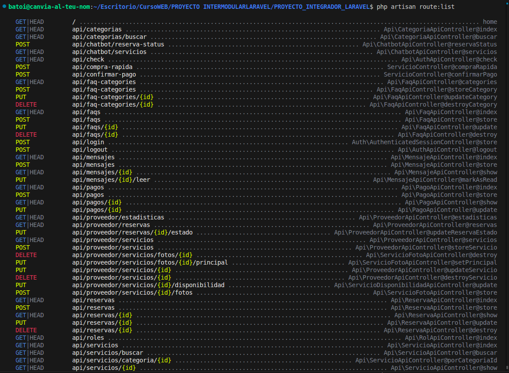

# Documentación Interactiva con Swagger

**Objetivo:** Facilitar la integración manual y técnica de la API para externos o futuros desarrolladores mediante una interfaz visual y funcional.

## Detalles de Implementación:

### 1. Catálogo Técnico de Endpoints

La API se ha estructurado siguiendo principios RESTful, agrupando las funcionalidades en módulos lógicos para facilitar su mantenimiento:

- **Módulo de Servicios (`/api/servicios`)**:
    - `GET /api/servicios`: Lista completa con filtros de búsqueda.
    - `GET /api/servicios/{id}`: Detalle técnico profundo, incluyendo disponibilidad y galería.
    - `GET /api/servicios/buscar`: Búsqueda geoespacial optimizada por coordenadas.
- **Módulo de Usuario y Sesión (`/api/auth`, `/api/usuario`)**:
    - `POST /api/login`: Generación de tokens de sesión Sanctum.
    - `GET /api/usuario`: Recuperación del perfil del usuario autenticado.
    - `PUT /api/usuario/foto`: Endpoint específico para carga asíncrona de avatares.
- **Módulo de Reservas (`/api/reservas`)**:
    - `POST /api/reservas`: Creación impulsada por validación de slots temporales.
    - `GET /api/reservas/{id}`: Consulta de estado y detalles de facturación.

### 2. Interfaz Visual Swagger UI

El proyecto expone una interfaz interactiva donde se definen los esquemas de datos (`Schemas`) y los modelos de respuesta esperados. Esto reduce drásticamente el tiempo de integración para el frontend.

### 3. Seguridad y Headers

Todos los endpoints sensibles requieren la inclusión del header `Accept: application/json`. Además, para rutas privadas, es obligatorio el header `Authorization: Bearer {token}`, gestionado de forma transparente por el middleware de **Laravel Sanctum**.
