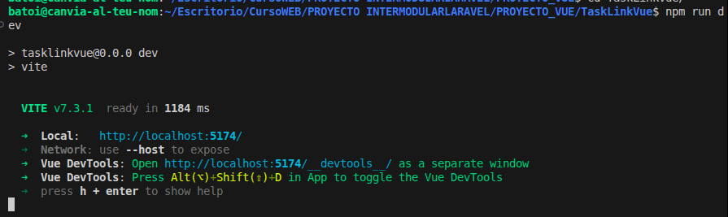

# Despliegue en Producción mediante Contenedores

**Objetivo:** Garantizar una transición fluida del entorno de desarrollo al entorno de producción, maximizando el rendimiento y la disponibilidad.

## Optimización y Build de la Aplicación:

### 1. Generación de Artefactos de Frontend (Vite)

Para producción, no utilizamos el servidor de desarrollo de Vite. En su lugar, generamos archivos estáticos altamente optimizados:

- **Comando**: `npm run build`.
- **Resultado**: Los archivos se minifican y se les añade un hash de versión en la carpeta `public/build`, lo que permite una gestión de caché agresiva en el navegador y reduce el tiempo de carga.

### 2. Preparación de la Imagen del Servidor

Se utiliza un **Dockerfile multi-stage** para construir el servicio `app`:

- **Instalación de Dependencias**: `composer install --no-dev --optimize-autoloader`.
- **Caché de Configuración**: Se ejecutan los comandos `php artisan config:cache`, `route:cache` y `view:cache` durante el despliegue para eliminar la latencia de lectura de archivos en cada petición.

### 3. Estrategia de Red y Seguridad

En producción, el puerto de MySQL y Redis no se expone al host. Solo el puerto del servidor Web (Nginx) es accesible externamente, creando una arquitectura de red aislada y segura.
