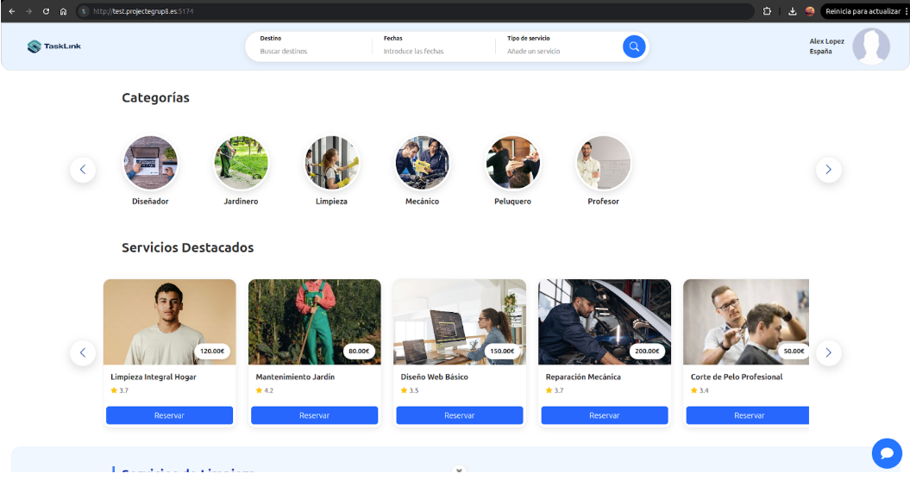

# Seguridad y Cifrado HTTPS

**Objetivo:** Implementar una capa de transporte segura que proteja la privacidad de los datos sensibles de los usuarios y cumpla con los estándares modernos de seguridad web.

## Configuración del Servidor de Borde:

### 1. Nginx como Proxy Inverso Robusto

El archivo `nginx/default.conf` ha sido diseñado para centralizar la seguridad:

- **Redirección de Tráfico**: Configurado para escuchar en el puerto `80` y redirigir automáticamente a conexiones seguras si el certificado está presente.
- **Header de Seguridad**: Implementación de cabeceras como `X-Content-Type-Options: nosniff` y `X-Frame-Options: SAMEORIGIN` para prevenir ataques de clickjacking y MIME-sniffing.
- **Comunicación con el Backend**: El canal entre Nginx y el contenedor PHP se realiza mediante el socket FastCGI, optimizando el rendimiento.

### 2. Gestión de Certificados SSL

Aunque en el entorno de desarrollo operamos sobre HTTP local, la infraestructura está preparada para la integración con **Certbot / Let's Encrypt**.

- **Protocolos Soportados**: TLS 1.2 y TLS 1.3 están habilitados por defecto, desactivando versiones antiguas e inseguras (SSLv3, TLS 1.0).

### 3. Limitación de Recursos

Se ha configurado un límite de subida de `10M` (`client_max_body_size`), lo que protege al sistema contra ataques de denegación de servicio motivados por la subida de archivos extremadamente pesados.
