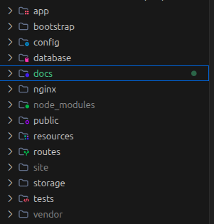
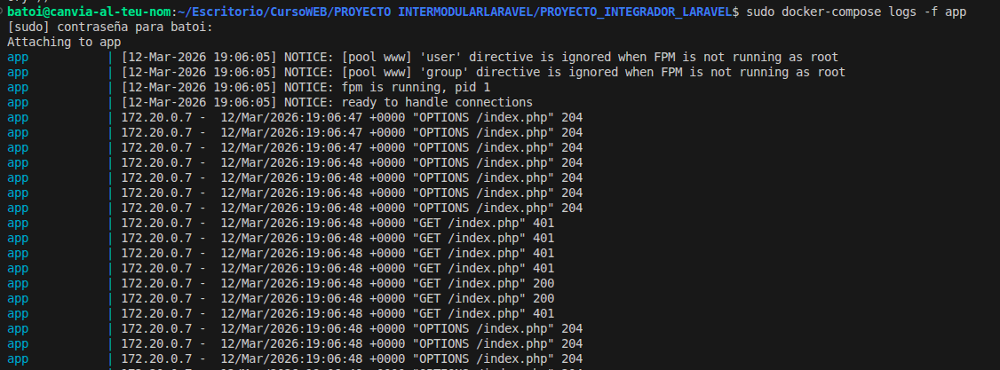

# Manual Técnico y Guía de Mantenimiento

**Objetivo:** Documentar los procedimientos críticos de operación y mantenimiento para asegurar la longevidad y estabilidad del sistema.

## Gestión Operativa:

### 1. Automatización de la Instalación

Se ha creado un script maestro de configuración en `composer.json` que encapsula toda la complejidad de "levantar" el proyecto en un nuevo entorno:

**Comando**: `composer setup`
Este script ejecuta secuencialmente:

1. `composer install`: Instalación de librerías PHP.
2. `key:generate`: Creación de la firma única de la aplicación.
3. `migrate --force`: Ejecución de todas las migraciones de base de datos.
4. `npm install`: Instalación de librerías de frontend.
5. `npm run build`: Compilación final de assets.

### 2. Monitorización y Logs

- **Logs de Aplicación**: Localizados en `storage/logs/laravel.log`. Se recomienda su rotación diaria.
- **Logs de Docker**: Accesibles mediante `docker-compose logs -f app` para depuración en tiempo real de errores de servidor PHP.

- **Estos son los logs de la aplicacion**: 

### 3. Backups y Recuperación de Datos

Para realizar un backup de la base de datos sin detener el sistema:

- **Comando**: `docker exec db /usr/bin/mysqldump -u laravel -plaravel laravel > backup.sql`.
- **Restauración**: Mediante la interfaz visual de **phpMyAdmin** disponible en el puerto `8080`.
