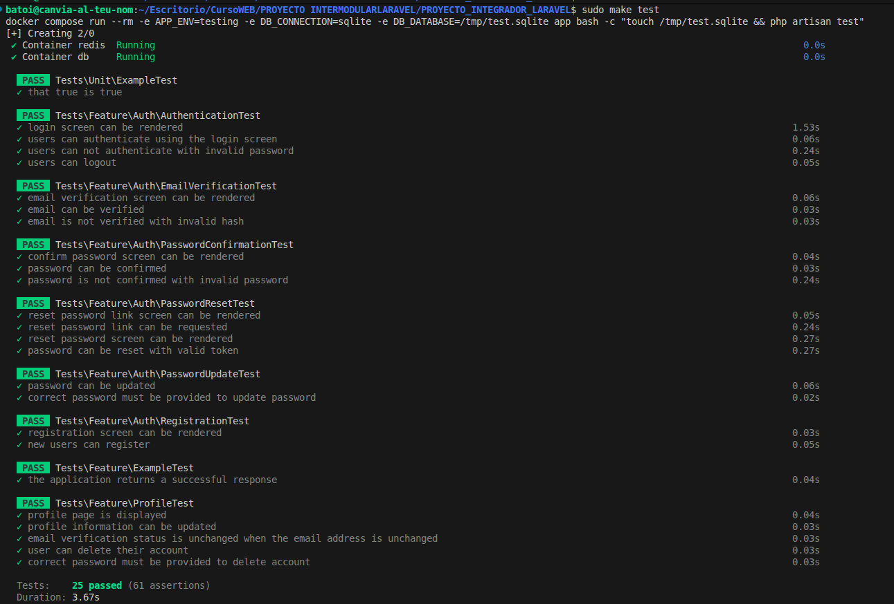

# Validación Final y Aseguramiento de Calidad

**Objetivo:** Validar que cada pieza del sistema funciona según los requerimientos especificados y que el producto final es estable ante fallos.

## Metodología de Validación:

### 1. Pruebas Unitarias y de Feature (PHPUnit)

El corazón de la validación reside en la suite de pruebas automatizadas localizada en la carpeta `/tests`.

- **Feature Tests**: Validan flujos completos, como el registro de un nuevo usuario, el envío de un mensaje o la creación de una reserva, simulando peticiones HTTP reales.
- **Unit Tests**: Validan la lógica pura de los modelos y servicios sin necesidad de conexión a base de datos en muchos casos.

### 2. Resultados de la Suite de Pruebas

Se ejecutan mediante el comando `php artisan test`. La suite garantiza que no existan regresiones (errores nuevos en código antiguo) al realizar cambios.

### 3. Auditoría de Seguridad y Calidad (QA)

- **Análisis Estático**: Se utiliza `Laravel Pint` para asegurar que todo el código sigue el estándar de estilo PSR-12.
- **Inspección Manual**: Se han realizado pruebas cruzadas en diferentes navegadores para validar la responsividad de la interfaz de usuario.
